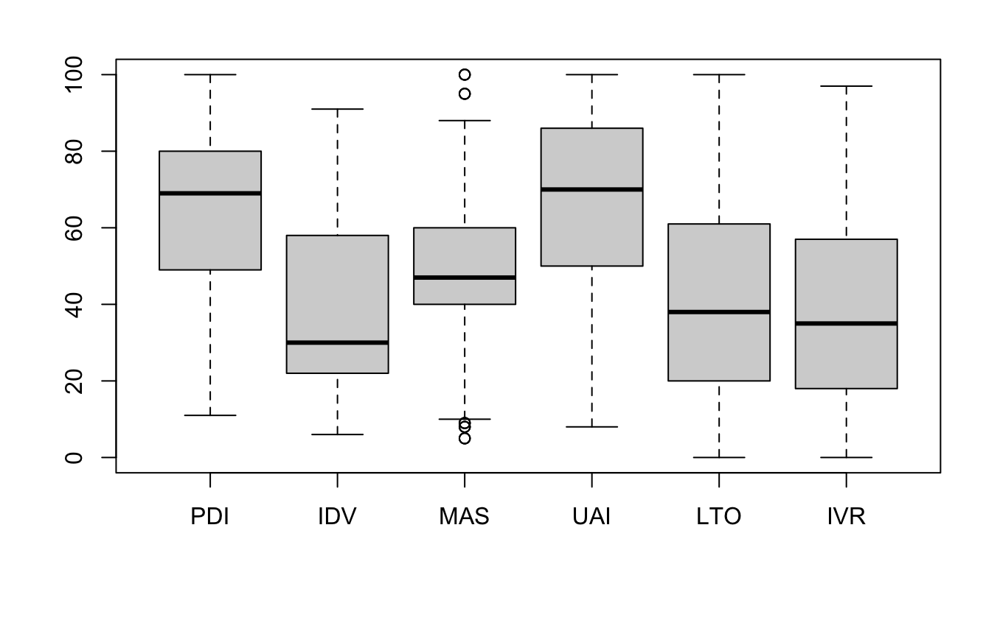
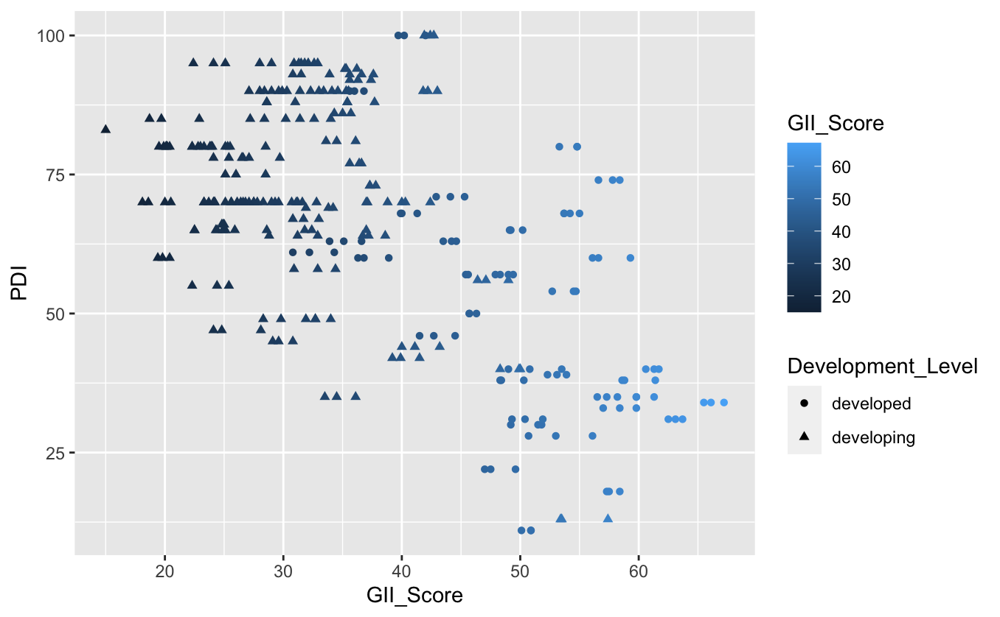
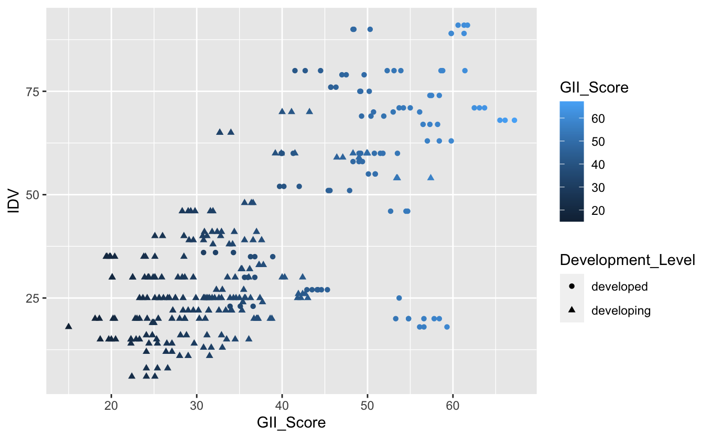
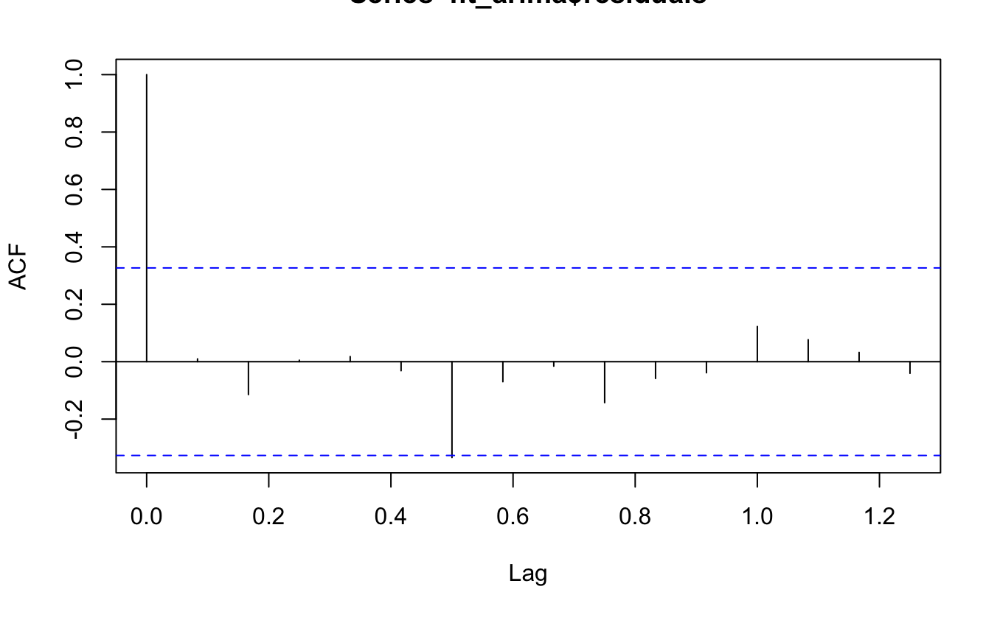
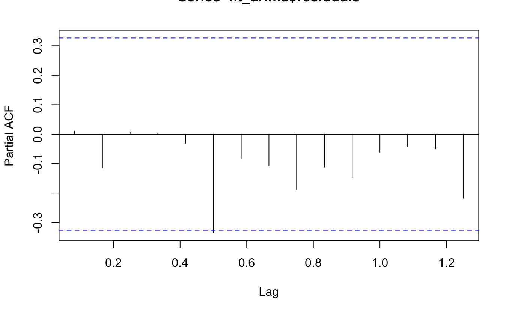

```{r setup, include=FALSE}
knitr::opts_chunk$set(echo = FALSE)
```

# Introduction

> This project examines the relationship between national culture and innovation using *Hofstede's 6D model* [^1] and the Global Innovation Index (GII) [^2] for developed and developing nations during the 2019-2021 period. The study aims to identify the impact of cultural values on innovation performance and how it changes over time. The findings will provide insights for innovation policy decisions.

[^1]: *. Source: <https://geerthofstede.com>*

[^2]: *. Source: <https://www.globalinnovationindex.org>*

## Objectives

Explore the links between national culture and innovation by examining the relationship between Hofstede's 6D model of national culture and the Global Innovation Index.

## Data

The data for this study was collected from original sources:

1\. [Geert Hofstede's website](https://www.geert-hofstede.com/countries.html)

2\. [World Intellectual Property Organization (WIPO)](https://www.wipo.int/gii/en/)

A brief summary of each of the six dimensions of national culture as defined by Hofstede::

| Dimension                   |                                             Value                                             |
|-----------------------------|:---------------------------------------------------------------------------------------------:|
| Power Distance (PDI)        |              The extent to which power and inequality are accepted in a society.              |
| Individualism (IDV)         |                  The degree to which individuals are integrated into groups.                  |
| Masculinity (MAS)           |           The degree to which traditional gender roles are reinforced in a society.           |
| Uncertainty Avoidance (UAI) |         The extent to which a society is comfortable with uncertainty and ambiguity.          |
| Long-term Orientation (LTO) |         The extent to which a society values long-term goals and traditional values.          |
| Indulgence (IVR)            | The degree to which people in a society are allowed to indulge in their impulses and desires. |

# Methodology

Data was collected on Hofstede's 6D model scores and Global Innovation Index scores for various countries. The countries were divided into developed and developing nations.

Pearson's correlation matrix and linear regression analysis were performed to examine the relationship between cultural values and innovation as measured by the GII.

OLS and robust regression models were applied and compared to determine the best fitting model.

Results were analyzed and discussed in relation to the hypotheses presented.

The study provided valuable insights on the impact of national culture on innovation, specifically highlighting the significance of cultural values on innovation performance.

{width="637"} {width="640"} {width="640"}{width="640"}

# Results

## Cross Sectional

##### A cross-sectional regression output (OLS Vs Robust)

| Models   | OLS                   | Robust              |
|----------|-----------------------|---------------------|
| Constant | 32.57091 \| (2.96095) | 30.7208 \| (2.9157) |
| PDI      | -0.14911 \| (0.02833) | -0.1531 \| (0.0279) |
| IDV      | 0.21898 \| (0.02824)  | 0.2494 \| (0.0278)  |
| MAS      | -0.01344 \| (0.02335) | -0.0280 \| (0.0230) |
| UAI      | -0.01920 \| (0.02043) | 0.0108 \| (0.0201)  |
| LTO      | 0.17260 \| (0.01649)  | 0.1526 \| (0.0162)  |
| IVR      | 0.03070 \| (0.01723)  | 0.0327 \| (0.0170)  |
| *RSE*    | 7.156                 | 6.483               |
| Obs.     | 298                   | 298                 |

: *Note: Standard errors in parentheses;*

### Discussion

|                    | All Countries | Developed Countries | Developing Countries |
|--------------------|---------------|---------------------|----------------------|
| Adjusted R-Squared | 0.6453        | 0.7363              | 0.4317               |
| P-Value            | \< 2.2e-16    | \< 2.2e-16          | \< 2.2e-16           |
| RSE                | 7.156         | 0.7198              | 5.559                |
| F-statistic        | 93.18         | 44.67               | 26.45                |
| Obs.               | 298           | 96                  | 195                  |

: The results of our analysis indicate that there is a clear link between cultural values and innovation as measured by the Global Innovation Index (GII). When examining all countries, developed nations, and developing nations, we found that cultural dimensions such as power distance and uncertainty avoidance had a strong positive correlation with innovation. However, this relationship was found to be stronger in developed nations compared to developing nations.

## Time Series Analysis

-   Series: data_ts ARIMA(0,1,0) sigma\^2 = 56.44: log likelihood = -120.24 AIC=242.48 AICc=242.61 BIC=244.04

{width="485"} {width="502" height="300"}

-   Box-Ljung test data: fit_arima\$residuals X-squared = 0.0037329, df = 1, p-value = 0.9513

### Discussion

Firstly, Despite the time variation, the correlations and cultural dimension values remained the same, and even the pandemic event 2020 could not change this pattern.

The output above shows that the X-squared value is 0.0037329 and the p-value is 0.9513. Since the p-value is greater than 0.05, we fail to reject the null hypothesis that the residuals are white noise. This suggests that the residuals of the ARIMA model are not correlated and are well-behaved, and that the model is a good fit for the data.

# Conclusions

This study investigated the impact of Hofstede cultural dimensions on the Global Innovation Index scores in three different years (2019, 2020 and 2021) to compare the impacts during pre- and post-crisis (COVID-19) period. The results showed that culture has an important component on innovative output of a country, however, it does not have a serious impact on the GII results of developing countries. However, the study has limitations such as a small sample size due to constrained datasets of Hofstede's cultural dimensions and GII overtime, which can cause a sample bias.
